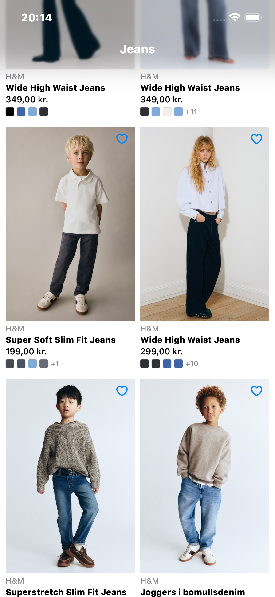
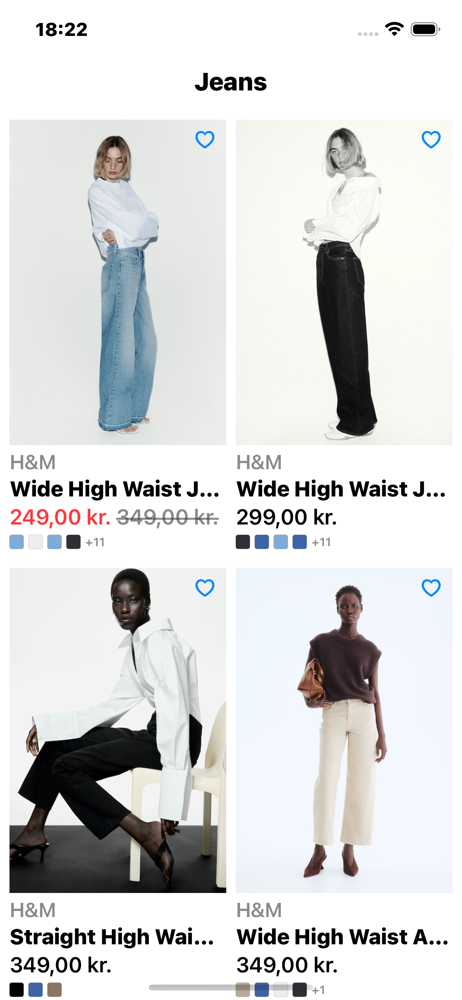
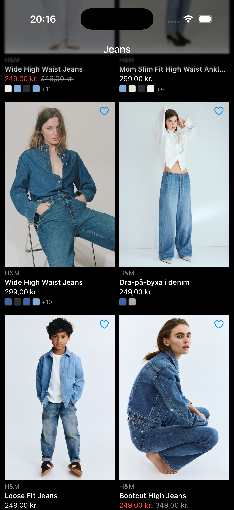
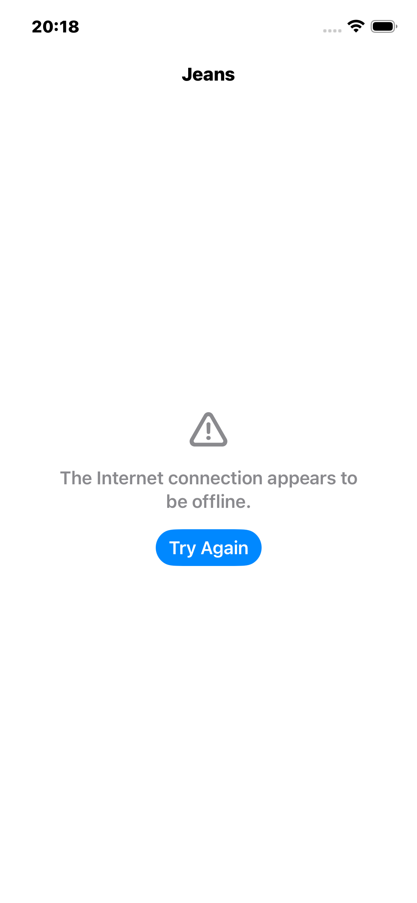

# H&M iOS Test Assignment

A SwiftUI application that displays a paginated list of jeans products from the H&M Search API.

## Screenshots

| Product List | Dynamic Type | Dark Mode | Error |
|:---:|:---:|:---:|:---:|
|  |  |  |  |

## Architecture

The project follows **MVVM + Clean Architecture** with clear separation of concerns:
```
HAndMTestAssignment/
├── App/                          # App entry point
├── Data/
│   ├── DTOs/                     # API response models (Codable)
│   ├── Network/                  # API client, endpoints, error handling
│   └── Repositories/             # Data access layer
├── Domain/
│   └── Models/                   # Business models
├── Features/
│   └── ProductList/              # Product list view and ViewModel
├── Shared/
│   ├── Components/               # Reusable UI components
│   └── Utilities/                # Image cache, constants, extensions
└── Resources/                    # Assets
```

### Layers

- **Data** — Handles API communication. DTOs mirror the JSON response and are mapped to domain models via `DTOMapper`, keeping the API contract separate from the rest of the app.
- **Domain** — Contains pure business models (`Product`, `PaginationInfo`) with no dependencies on the Data or UI layers.
- **Features** — Each feature is a self-contained module with its own View and ViewModel. `ProductListViewModel` manages pagination state, loading, and error handling.
- **Shared** — Reusable components like `CachedAsyncImage`, `StatusView`, and `ImageCache` that could be used across multiple features.

### Data Flow
```
API → DTOs → DTOMapper → Domain Models → Repository → ViewModel → View
```

The ViewModel communicates state changes to the View through the `@Observable` macro. The View renders different states (loading, loaded, error, empty) based on the ViewModel's `ViewState` enum.

## Key Technical Decisions

### DTO ↔ Domain Model Separation
API response models are decoupled from business models. If the API changes, only the DTO and the mapper need updating — the rest of the app is unaffected.

### Protocol-Based Design
Both `APIClientProtocol` and `ProductRepositoryProtocol` are defined as protocols, enabling dependency injection and making every layer independently testable with mock implementations.

### Custom Image Loading with NSCache
Built a custom `CachedAsyncImage` view instead of using `AsyncImage` for full control over:
- **Server-side optimization** — Appends `?imwidth=400` to image URLs, reducing download size from ~1 MB to ~30-50 KB per image.
- **In-memory caching** with `NSCache` (100 items, 50 MB limit) with automatic eviction under memory pressure.
- **Disk caching** via `URLCache` (20 MB memory, 100 MB disk) for instant reload on revisit.
- **Synchronous cache lookup** on appear — cached images display instantly with zero flicker when scrolling back.
- **Automatic retry** for failed image loads when cells reappear (handles server rate-limiting gracefully).

### Pagination
The ViewModel triggers the next page fetch when the user scrolls to 70% of the current list, giving the network request time to complete before the user reaches the bottom. Duplicate products across pages are filtered by ID.

### Configurable Endpoint
The `Endpoint` enum breaks the API URL into independently configurable components (scheme, subdomain, domain, service, version, locale, path, query parameters), making it easy to switch environments or API versions.

## Accessibility

- **VoiceOver** — Each product card is read as a single combined element: brand, name, price, and available colors. The favorite button has its own accessibility label. Color swatches are hidden from VoiceOver since colors are described in the card label.
- **Dynamic Type** — All text uses system fonts that scale with the user's preferred text size, capped at `xxxLarge` to protect the grid layout. Product names reserve space for two lines to maintain consistent card alignment across all text sizes.
- **Dark Mode** — Semantic colors (`.primary`, `.secondary`) adapt automatically to light and dark appearances. Placeholders and swatch borders work in both modes.

## Performance

- **Server-side image resizing** via `?imwidth=400` reduces image payloads by ~95%, from ~1 MB to ~30-50 KB each.
- **LazyVGrid** renders only visible cells, keeping memory stable during scrolling.
- **NSCache** with configurable limits and memory warning observer for automatic cleanup.
- **Connection limiting** (`httpMaximumConnectionsPerHost: 6`) prevents overwhelming the image server during fast scrolling.
- **Task cancellation** — Image downloads are automatically cancelled when cells scroll off screen via SwiftUI's `.task(id:)` lifecycle.
- **No memory leaks** — Verified with Instruments Leaks tool.

## Testing

Unit tests cover the core business logic using Swift Testing framework:

- **ProductListViewModelTests** — Initial load, empty state, error handling, pagination, retry, duplicate filtering.
- **DTOMapperTests** — Product mapping, image fallback, sale price handling, pagination mapping.

Tests use mock implementations (`MockProductRepository`, `MockAPIClient`) injected via protocols, with no network calls.

## Requirements

- iOS 17.0+
- Xcode 16+
- No third-party libraries

## How to Run

1. Clone the repository
2. Open `HAndMTestAssignment.xcodeproj` in Xcode
3. Select a simulator (iPhone 16 Pro recommended)
4. Press `Cmd + R` to build and run
5. Press `Cmd + U` to run tests
